# Secureframe Ops

**A compliance baseline without a folder full of personal data.**



A standalone skill for **Codex · Claude Code · Cursor**, backed by a portable Python CLI.
Independent community project; not affiliated with or endorsed by the provider.

## ✨ What it does

- Inspect compliance resources through the official REST API with explicit US or UK account targeting.
- Export only fetched counts, reported totals and known status buckets; names, emails, IDs and free-text fields never enter baseline files.
- Mark capped collection as incomplete and create private, non-overwriting exports.
- Optionally capture authenticated GraphQL request metadata through Playwright: allow parsed queries, block mutations and unknown APIs, and keep session state outside the checkout.

## 🚀 Install

Requires Node.js **22.20+** for the tested skills installer.

```sh
npx skills@1.7.1 add joeeeeey/secureframe-ops --agent codex claude-code cursor --yes
```

The implementation is initially delivered in a pull request. Until that PR is merged,
reviewers can install the branch with:

```sh
npx skills@1.7.1 add 'https://github.com/joeeeeey/secureframe-ops#feat/standalone-skill' --agent codex claude-code cursor --yes
```

Then ask your agent to use **secureframe-ops**. The standard SKILL.md and bundled CLI are the
portable interface; no dependency on another personal skill is needed.

## 🔎 Try it

From the installed skill directory, or a repository checkout:

```sh
python3 scripts/secureframe_api.py list tests --limit 25 --summary
python3 scripts/secureframe_api.py baseline --out-dir /private/path/review --dry-run
```

Python 3.10+. `SECUREFRAME_API_KEY` + `SECUREFRAME_API_SECRET`, their `_FILE` equivalents, or `SECUREFRAME_AUTH`. No implicit credential-file search. Optional `SECUREFRAME_API_BASE=https://api-uk.secureframe.com`; US is default.

Run `python3 scripts/secureframe_api.py --help` for all commands.
Use a secret manager or a private local file for credentials; avoid pasting values into shell history.

## How to use it well

Use summary mode first. For a baseline, explain count-only scope and pagination cap, then write to a private user-selected directory. Report `complete: false` instead of implying a full audit. A passing count is not compliance certification. Raw list/get output is account-private even after secret-field redaction.

## 🖥️ Optional browser session

The REST helper needs no npm dependencies. For browser metadata discovery, see
[browser workflow](references/browser.md). Login and MFA remain manual. Capture is tested
against a synthetic local app; authenticated Secureframe UI behavior is not certified.

## 🧪 Compatibility and verification

| Layer | Scope |
| --- | --- |
| Runtime | Python 3.10+; dependency-free standard library helpers |
| Agent interface | Standard SKILL.md + relative scripts; Codex, Claude Code, Cursor |
| Offline verification | Synthetic fixtures and mocks; run `python3 -m unittest discover -s tests -v` |
| Installation / native execution | See [validation evidence](references/validation.md) for exact tested levels |
| Live account operations | Not exercised as part of this release |

The illustration uses declarative SVG animation, with a readable static state and reduced-motion
fallback. It contains no JavaScript, external font or remote image dependencies.

## Limits and data handling

Read-only REST implementation plus optional Playwright manual-login and query-metadata capture. No evidence upload or browser mutation executor. The official MCP server is an optional alternative described in references/api.md; this package does not configure it or claim to test it. Baselines are not an atomic snapshot and contain no per-item evidence.

Secret-like fields and configured credential values are redacted where supported. Ordinary
resource names, logs and account metadata may still be private: review output before sharing.

[Official documentation and API notes](references/api.md) · [MIT license](LICENSE)

## Provenance

Extracted and maintained from the author's existing local skill implementation, with
account-specific defaults and private operational notes removed. Documentation, fixtures and
SVG artwork in this distribution are original. External runtimes and provider services retain
their own licenses and terms; this repository does not redistribute them.
